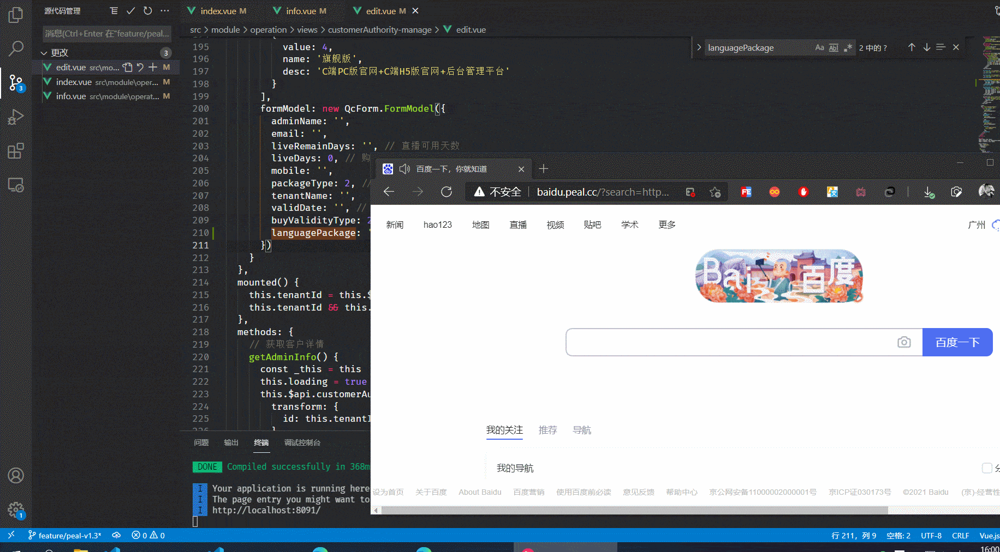

# prevent-boss

一个防老板的网站工具，这是下午突然想到的 idea 就写出来了

可以用来偷摸着看视频、看长资讯、打打页游

如图演示：鼠标在网页中则显示，移出则马上变成百度

附上链接： http://baidu.peal.cc?search=https://bilibili.com

> search 后面可以跟任何你用来摸鱼的网站，必须是完整的 url 如：http://xxxx.com
> from 参数默认为百度，如果不想用百度来隐藏自己那就使用这个参数，规则和上面一样

推荐搭配摸摸鱼热榜食用更佳 https://momoyu.cc 

目前有几个问题： 
- 一是从这个工具中点击跳转出去的新页面无效，这个无法解决
- 二是不支持在里面做登录等cookie操作，这个问题可以通过正常打开网页进行登录后再用工具进入改网页